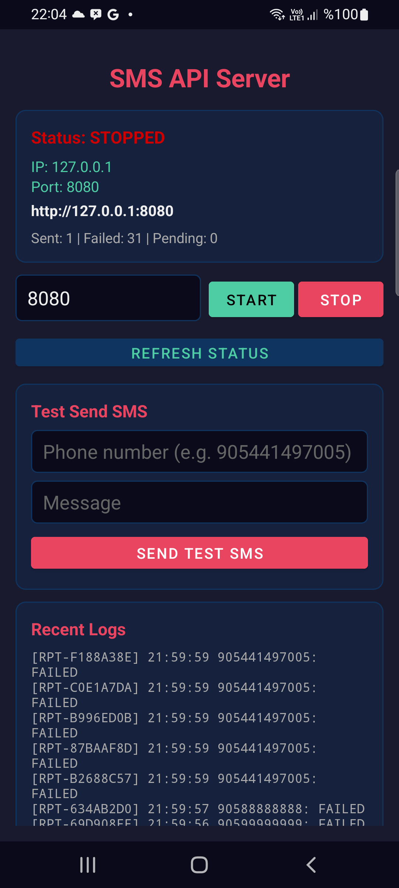
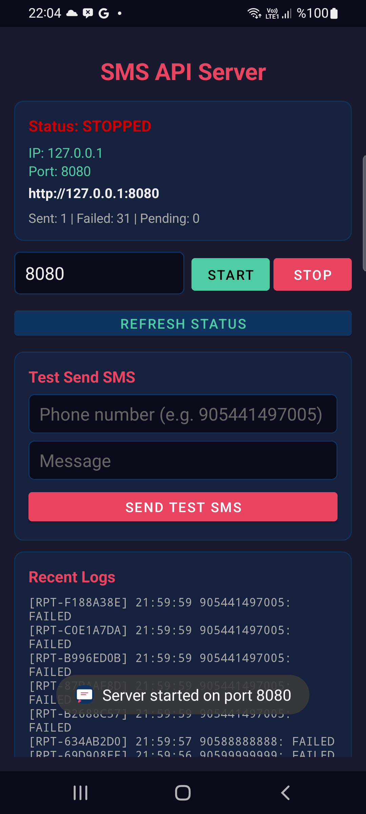
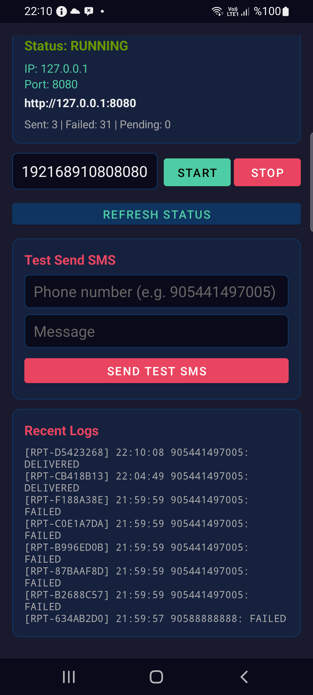

# Jasmin Android Server

Turn your Android phone into an SMS gateway with HTTP API + SMPP server.

Think of it as an Android counterpart to Jasmin SMS gateway - send SMS directly from your phone.

## Screenshots

| App UI (Stopped) | App UI (Running) |
|:---:|:---:|
|  |  |

| Logs & Reports | DELIVERED Status |
|:---:|:---:|
|  |  |

## Features

### HTTP API
- `POST /api/send` - Send a single SMS
- `POST /api/send-bulk` - Send bulk SMS
- `GET /api/status` - Server status
- `GET /api/report/{id}` - SMS report by report ID
- `GET /api/reports` - All reports
- `GET /api/logs` - SMS logs
- `GET /api/info` - Device/SIM/network info
- `GET /api/incoming` - Incoming SMS history
- `GET /api/contacts` - Contact list
- `POST /api/contacts` - Add contact
- `DELETE /api/contacts/{phone}` - Delete contact

### SMPP Server
- `POST /api/smpp/start` - Start SMPP server
- `POST /api/smpp/stop` - Stop SMPP server
- `GET /api/smpp/status` - SMPP status

SMPP server listens on port 2775. Default credentials:
- systemId: `smsapi`
- password: `password`

### Supported SMPP Commands
- `BIND_TRANSMITTER` / `BIND_RECEIVER` / `BIND_TRANSCEIVER`
- `SUBMIT_SM` - Send SMS
- `DELIVER_SM` - Delivery reports (receipts sent back to receiver sessions)
- `ENQUIRE_LINK` - Link keepalive
- `UNBIND` - Disconnect
- `GENERIC_NACK` - Negative acknowledgement

### SMPP Protocol Support
- **SMPP v3.4** (interface_version 0x34)
- **SMPP v5.0** (interface_version 0x50)
- **TLV Optional Parameters** (message_payload, sc_interface_version, etc.)

### SMPP Features
- **Long SMS**: Multipart/concatenated SMS reassembly (UDH parsing)
- **Data Coding**: GSM 7bit, IA5/ASCII, UCS2, UTF-8, Latin
- **Delivery Reports**: DELIVER_SM sent to bound RECEIVER/TRANSCEIVER sessions
- **Incoming SMS**: SMS_RECEIVED forwarded to SMPP clients via DELIVER_SM
- **Contact Names**: Auto-linked to SMS reports from contacts database

## Incoming SMS

When the phone receives an SMS, it is:
1. Stored in SQLite database (`incoming_sms` table)
2. Forwarded to all bound SMPP RECEIVER/TRANSCEIVER sessions via `DELIVER_SM`
3. Available via `GET /api/incoming`

Any SMPP client bound as RECEIVER or TRANSCEIVER will receive incoming SMS in real-time.

## Setup

1. Open the project in Android Studio
2. Install on a device with `minSdk 26+`
3. Launch the app and tap "Server Start"
4. HTTP API: `http://<phone-ip>:8080`
5. SMPP: `<phone-ip>:2775`

## Example: Send SMS via HTTP API

```bash
curl -X POST http://192.168.9.10:8080/api/send \
  -H "Content-Type: application/json" \
  -d '{"phone":"905441497005","message":"Hello World!"}'
```

## Example: Send SMS via SMPP Client

```python
import socket, struct

def write_cstring(s):
    return s.encode('ascii') + b'\x00'

sock = socket.socket(socket.AF_INET, socket.SOCK_STREAM)
sock.connect(('192.168.9.10', 2775))

# BIND
body = write_cstring('smsapi') + write_cstring('password') + write_cstring('') + b'\x34'
pdu = struct.pack('>IIII', 16+len(body), 0x00000002, 0, 1) + body
sock.sendall(pdu)
sock.recv(1024)

# SUBMIT_SM
msg = "Hello World!"
body = (write_cstring('') + b'\x00\x00' + write_cstring('9050000000') +
        b'\x01\x01' + write_cstring('905441497005') +
        b'\x00\x00\x00' + write_cstring('') + write_cstring('') +
        b'\x01\x00\x00\x00' + bytes([len(msg)]) + msg.encode())
pdu = struct.pack('>IIII', 16+len(body), 0x00000004, 0, 2) + body
sock.sendall(pdu)
resp = sock.recv(1024)

sock.close()
```

## Report System

Every SMS gets a report ID (`RPT-XXXXXXXX`). Track SMS status with this ID:
- `PENDING` - Being sent
- `SENT` - Handed to GSM network
- `DELIVERED` - Reached the recipient
- `FAILED` - Failed

## Contact System

Name your phone numbers. Contact names are automatically attached to SMS reports.

```bash
# Add a contact
curl -X POST http://192.168.9.10:8080/api/contacts \
  -H "Content-Type: application/json" \
  -d '{"phone":"905441497005","name":"John","group":"friends"}'
```

## Remote Access via Tailscale

Install [Tailscale](https://tailscale.com) on both your phone and your computer for secure remote access without port forwarding.

### Setup

1. Install Tailscale from Play Store on your Android phone
2. Install Tailscale on your computer
3. Log in with the same account on both devices
4. Find your phone's Tailscale IP: run `tailscale status` on your computer

### Usage

Once connected, use the Tailscale IP instead of local IP:

```bash
# HTTP API
curl -X POST http://<tailscale-ip>:8080/api/send \
  -H "Content-Type: application/json" \
  -d '{"phone":"905441497005","message":"Hello via Tailscale!"}'

# SMPP (connect from any SMPP client)
# Host: <tailscale-ip>, Port: 2775
```

### Benefits

- No port forwarding or firewall rules needed
- End-to-end encrypted traffic
- Works from anywhere (phone on mobile data, computer on any network)
- Static IPs per device (no dynamic DNS needed)

## Requirements

- Android 8.0+ (API 26)
- Root access (for network status)
- SMS permission

## License

MIT
